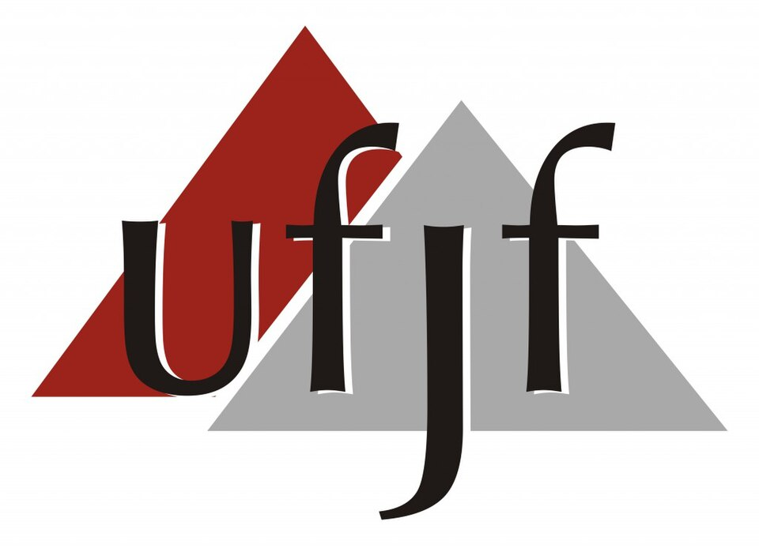
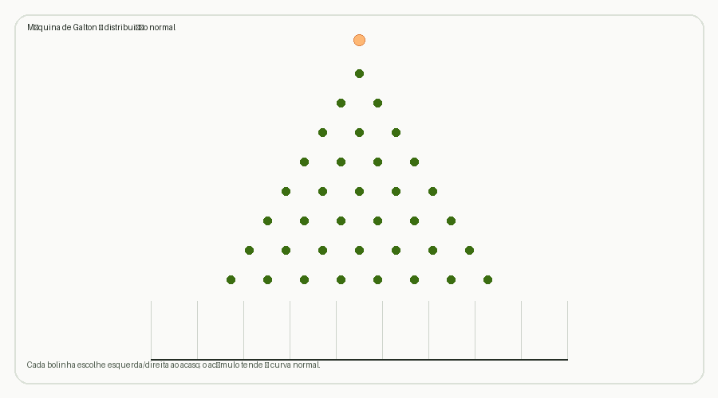

# Gabriel Mazzetti

*Clarice Lispector*

---

Estudante de Estatística na Universidade Federal de Juiz de Fora (UFJF), com interesse em análise de dados, inferência estatística e modelagem probabilística.

Tenho interesse especial em Estatística de Alta Dimensão, particularmente em métodos de esparsidade e seleção de variáveis, e em Estatística Computacional. Gosto de explorar a relação entre fundamentos estatísticos, métodos matemáticos e implementação computacional, buscando compreender não apenas como aplicar um método, mas também os princípios que estão por trás dele.

 

**Projetos Atuais:**
- Embrapa Gir Leiteiro: Atuando na limpeza de dados, formatação de tabelas complexas e mapeamento de fazendas colaborativas usando Quarto, além de contribuir para a produção do livro digital *"Sumário Brasileiro de Touros"* das raças Gir e Girolando. Também presente na produção dos aplicativos *Right Sire*, programados utilizando *R Shiny*, das mesmas raças dos Sumários.
- Estatística de Alta Dimensão: Estudando técnicas avançadas de regularização e esparsidade em modelos estatísticos, com foco em regressão Lasso (Least Absolute Shrinkage and Selection Operator).

**Experiências Anteriores:**
- PET Saúde (SUS/JF): Atuei na equipe de desenvolvimento de uma plataforma gamificada para promoção da saúde pública no Sistema Único de Saúde em Juiz de Fora, sendo um dos responsáveis pela programação na fase inicial do projeto.
- Equipe de Robótica Rinobot (UFJF): Participei da equipe com foco no desenvolvimento de software e trabalho em equipe, aplicando conhecimentos práticos em um ambiente multidisciplinar no contexto da robótica.
- Iniciação Científica: Estudei Python, especialmente no contexto de Web Scraping, e desenvolvi, em formato de livro digital, um conteúdo instrutivo para estatísticos (e cientistas de dados no geral) que desejam aprender a linguagem.

 

  

---

  

---

<table>
<tr><td><code>GitHub</code></td><td><a href="https://github.com/GabrielMazzetti">github.com/GabrielMazzetti</a></td></tr>
<tr><td><code>LinkedIn</code></td><td><a href="https://linkedin.com/in/gabrielmazzetti">linkedin.com/in/gabrielmazzetti</a></td></tr>
<tr><td><code>E-mail</code></td><td>gabrielaffonso84@gmail.com</td></tr>
</table>

---